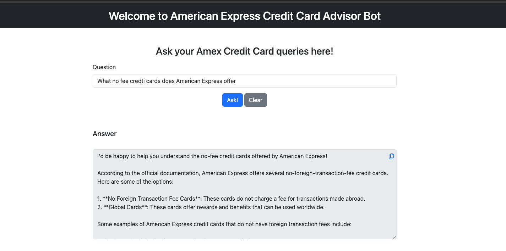

  
  <h1>American Express Credit Card Advisor </h1>

# 🌐 Description

> This project ingests all the information about american express credit cards from its website and then answer customer's questions. 

## 📚 Table of Contents

- [Prerequisites](#-prerequisites)
- [Application Screenshot](#-application-screenshot)

### 📋 Prerequisites

- Java 20
- Maven
- API keys for [Open API](https://platform.openai.com/)

## 📸 Application Screenshot

